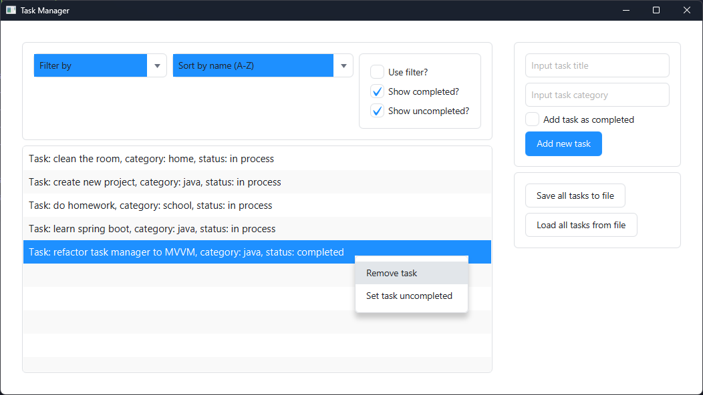
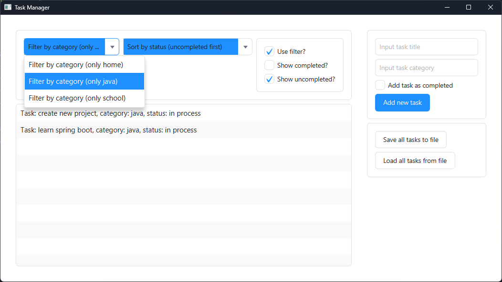
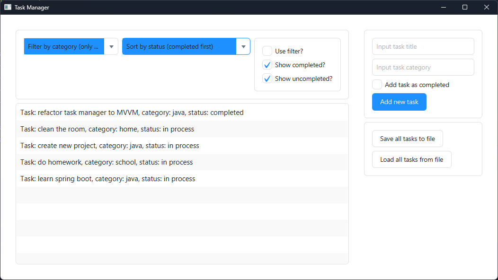

# Java FX Task Manager

## 📌 Description
Simple Task manager with a graphical interface written in Java using JavaFX. This project was created to study bindings.

## 🚀 Features
- Add task to general task list with form
- Sort task list
- Filter task list by categories and completion status
- Remove task or change completion status by clicking RMB
- Save task list in file
- Load task list from file

## ⚙️ How It Works

The application uses JavaFX bindings and NIO:

- `ObservableList` stores tasks
- `FilteredList` applies filtering
- `SortedList` applies sorting
- UI updates automatically via bindings
- NIO provides opportunity to work with files

## 📸 Screenshots

| Main UI                                       | Filtering                                       | Sorting                                       |
|-----------------------------------------------|-------------------------------------------------|-----------------------------------------------|
|  |  |  |

## ⚙️ Installation & Run
1. Clone repository:
```bash
git clone https://github.com/lyney19/TaskManager.git
```
2. Open in IDE (IntelliJ IDEA, Eclipse)
3. Run `Main.java`

## 🛠 Tech Stack
- Java
- JavaFX

## 📁 Project Structure
```
TaskManager/
├─ src/
│  └─ main/
│     ├─ java/
│     │   ├─ Main.java            # Entry point
│     │   ├─ MainController.java  # Main window controller
│     │   ├─ SortedMode.java      # Enum of sorting modes
│     │   ├─ TaskProperty.java    # ViewModel data class
│     │   ├─ TaskViewModel.java   # ViewModel
│     │   ├─ Task.java            # Model data class
│     │   └─ TaskService.java     # Model service
│     └─ resources/
│        ├─ main.fxml             # Main window FXML
│        └─ theme.css             # Main CSS theme
```

## 🧠 What I Learned
- JavaFX bindings
- JavaFX collections
- Basics of the declarative approach to programming
- FXML and CSS basics
- Basics of the MVVM architecture

## 🔮 Future Improvements
### 🧠 Architecture
- [ ] Refactor `TaskViewModel` into smaller view models (e.g. `TaskListViewModel`, `FilterViewModel`)
- [ ] Introduce Dependency Injection instead of `TaskService`
- [ ] Refactor `initialize()` in controller

### 💾 Persistence
- [ ] Replace file-based storage with database (e.g. SQLite)
- [ ] Add export/import (JSON / CSV)

### 📦 Features
- [ ] Add UID for every task
- [ ] Add search functionality
- [ ] Improve filtering tasks